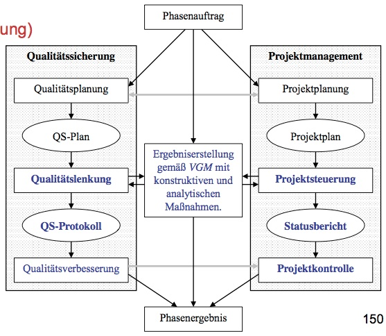
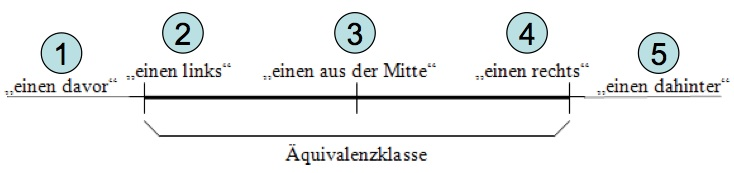
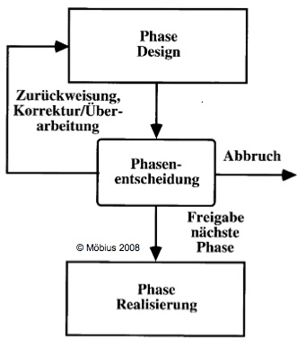
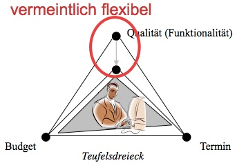
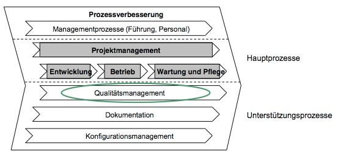
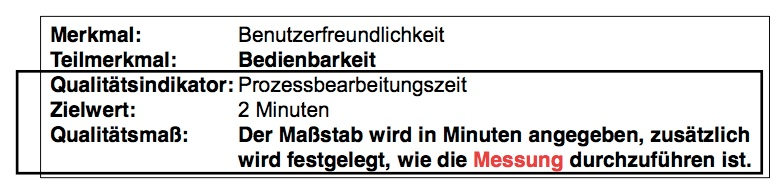
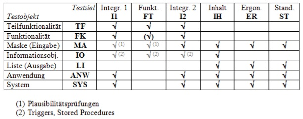
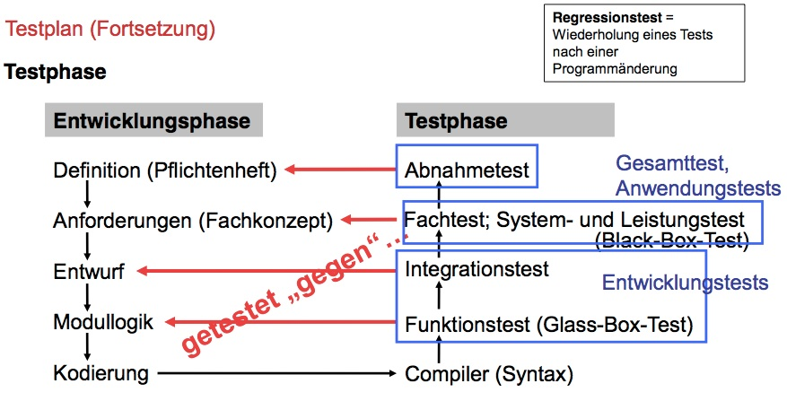
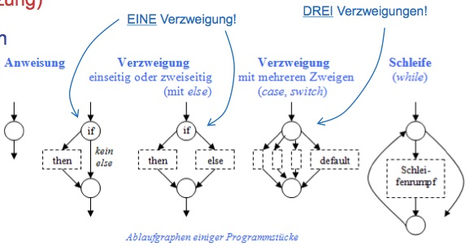

QPM Compilation
===============

[https://github.com/devfoo-one/QPM-Klausurvorbereitung](https://github.com/devfoo-one/QPM-Klausurvorbereitung)

Qualität
========

Was ist Qualität?
-----------------

> Qualität ist die Gesamtheit der **Eigenschaften** und **Merkmale** eines **Produkts** oder einer **Tätigkeit**, die sich auf deren Eignung zur Erfüllung gegebener Erfordernisse bezieht.

5 Ansätze um Qualität zu erklären:

1.	transzendentaler (übernatürlicher) Ansatz

	-	Qualität ist universell erkennbar, absolut, einzigartig und vollkommen.
	-	Qualität kann nicht exakt definiert oder gemessen werden.

2.	produktbezogener Ansatz

	-	Qualität ist eine messbare, genau spezifizierte Größe, die das Produkt beschreibt und durch die man Qualitätsunterschiede aufzeigen kann.
	-	Subjektive Beobachtungen und Wahrnehmungen werden nicht berücksichtigt.

3.	benutzerbezogener Ansatz

	-	Qualität wird durch den Produktbenutzer festgelegt.
	-	Benutzer entscheidet, ob es sich um ein Qualitätsprodukt handelt oder nicht
	-	da verschiedene Benutzer unterschiedliche Wünsche haben, werden diejenigen Produkte als qualitativ hochwertig angesehen, die die Bedürfnisse einer Vielzahl von Benutzern am besten befriedigen

4.	prozessbezogener Ansatz

	-	Qualität entsteht durch die richtige Erstellung des Produkts

5.	Kosten-/Nutzenbezogener Ansatz

	-	Qualität ist eine Funktion von Kosten und Nutzen
	-	Ein Qualitätsprodukt ist ein Erzeugnis, das einen bestimmten Nutzen zu einem akzeptablen Preis erbringt

Softwarequalität
----------------

Die Softwarequalität gehört zu den **nicht-funktionalen Anforderungen** an ein Softwareprodukt.

DIN ISO 9126:

> Softwarequalität ist die Gesamtheit der **Merkmale** und **Merkmalswerte** eines Softwareprodukts, die sich auf die **Eignung** beziehen, festgelegte oder vorausgesetzte **Erfordernisse** zu erfüllen.

### Qualitätsmerkmale von Software

Sechs Qualitätsmerkmale werden allgemin unterschieden. Diese können auf jede Art von Software angewandt werden:

-	**Funktionalität**
	-	*Richtigkeit*
		-	liefert die richtigen oder vereinbarten Ergebnisse
	-	*Sicherheit*
		-	beabsichtigten oder unbeabsichtigten unberechtigten Zugriff verhindern
	-	*Interoperabilität*
		-	Fähigkeit, mit externen Systemen zusammenzuwirken
	-	*Angemessenheit*
		-	Eignung der Funktion für die Aufgabe
	-	*Ordnungsmäßigkeit*
		-	Erfüllung anwenderspezifischer Normen, Vereinbarungen...
	-	...
-	**Zuverlässigkeit**
	-	*Reife*
		-	geringe Versagenshäufigkeit durch Fehlerzustände
	-	*Wiederherstellbarkeit*
		-	bei einem Versagen das Leistungsniveau wiederherstellen und die direkt betroffenen Daten wiedergewinnen
	-	*Fehlertoleranz*
		-	spezifiziertes Leistungsniveau bei Softwarefehlern bewahren
	-	...
-	**Benutzbarkeit**
	-	*Verständlichkeit*
		-	Aufwand für den Benutzer, das Konzept und die Anwendung zu verstehen
	-	*Erlernbarkeit*
		-	Aufwand für den Benutzer, die Anwendung zu erlernen
	-	*Bedienbarkeit*
		-	Aufand für den Benutzer, die Anwendung zu bedienen
	-	...
-	**Effizienz**
	-	*Zeitverhalten*
		-	Antwort- und Verarbeitungszeiten sowie Durchsatz bei der Funktionsausführung
	-	*Verbrauchsverhalten*
		-	Anzahl und Dauer der benötigten Betriebsmittel (Ressourcen) für die Erfüllung der Funktionen
	-	...
-	**Änderbarkeit** (findet er wohl besonders interessant!)
	-	*Analysierbarkeit*
		-	Aufwand, um Mängel oder Ursachen von Versagen zu diagnostizieren
	-	*Modifizierbarkeit*
		-	Aufwand zur Ausführung von Verbesserungen, zur Fehlerbeseitigung oder Anpassung an Umgebungsänderungen
	-	*Prüfbarkeit*
		-	Aufwand, der zur Prüfung der geänderten Software notwendig ist
		-	Das Außmaß, in dem ein System das Erstellen von Testbedingungen sowie die Durchführung der Tests erleichtert.
	-	*Stabilität*
		-	Wahrscheinlichkeit des Auftretens unerwarteter Wirkungen von Änderungen, Seiteneffekte
	-	...
-	**Übertragbarkeit**
	-	*Anpassbarkeit*
		-	Möglichkeiten, die Software an verschiedene, festgelegte Umgebungen anzupassen
	-	*Installierbarkeit*
		-	Aufwand, der zum Installieren der Software in einer festgelegten Umgebung notwendig ist
	-	...

Qualitätssicherungsmaßnahmen
----------------------------

***kommen lt. Klausurvorbereitung nicht dran, da wir diese in der VL nicht abgehandelt hatten***

### konstruktive Qualitätssicherung

### analytische Qualitätssicherung

Qualitätsmanagement
-------------------

***projektübergreifend***

> **Qualitätsmanagement** umfasst alle Tätigkeiten der Gesamtführungsaufgabe, welche die **Qualitätspolitik, Ziele und Verantwortungen festlegen** sowie diese durch Mittel wie Qualitätsplanung, Qualitätslenkung, Qualitätssicherung und Qualitätsverbesserung im Rahmen des Qualitätsmanagementsystems **verwirklichen** (DIN EN ISO 8402)

Qualitätsmanagement sind *strategische*, ***projektübergreifende***, *aufeinander abgestimmte Tätigkeiten* zum *Leiten und Lenken einer Organisation* bezüglich der *Qualität* die in einem Qualitätsmanagementsystem, beispielsweise einem QM-Handbuch, festgelegt werden.

Qualitätssicherung
------------------

***sichert ein einzelnes Projekt***

> Qualitätssicherung ist der während der Durchführung des Projekts stattfindende, **operative Teil des Qualitätsmanagements**, der auf das Erzeugen von Vertraufen darauf gerichtet ist, dass vorgegebene Qualitätsanforderungen erfüllt werden.

Das heißt, Qualitätsmanagement beschreibt in der Regel das, **was** im Projekt im Rahmen der Qualitätssicherung **wie** durchzuführen ist.

Die Qualitätssicherung wird oft in drei Bereiche eingeteilt:

1.	**Konstruktive** Qualitätssicherungsmaßnahmen
	-	versuchen **vor Beginn** einer Entwicklungsphase, Probleme gar nicht erst entstehen zu lassen
	-	z.B. QS-Checkliste
2.	**Analytische** Qualitätssicherungsmaßnahmen
	-	suchen Fehler in den Objekten der Qualitätssicherung, damit man sie beheben kann
	-	**Objekte der QS** sind **alle Arbeitsergebnisse eines Projekts** (egal ob Dokumente oder Software)
	-	können nur noch **nachträglich** Verbesserungen erwirken
3.	**Organisatorische** Maßnahmen
	-	schaffen den Rahmen, damit konstruktive und analytische QS-Maßnahmen wirken können.

### Analytische Verfahren zur Qualitätssicherung

1.	**Testende** Verfahren (haben das **Ziel, Fehler zu erkennen.** )
	-	Dynamische Testverfahren
		-	Die Systemkomponente **wird ausgeführt** um Fehler zu finden.
	-	Statische Testverfahren
		-	Systemkomponente wird nicht ausgeführt, sondern **der Quellcode wird analysiert** um Fehler zu finden
2.	**Verifizierende** Verfahren (**beweisen die Korrektheit einer Systemkomponente** )
	-	Verifikation
		-	beweist mit mathematischen Mitteln die Konsistenz zwischen der Spezifikation und der Implementierung einer Systemkomponente
	-	Symbolische Ausführung
		-	Ein Quellprogramm wird mit allgemeinen symbolischen Eingabewerten durch einen Interpreter ausgeführt
3.	**Analysierende** Verfahren (**vermessen bestimmte Eigenschaften** von Systemkomponenten)
	-	Analyse der Bindungsart
		-	ein funktionales Modul soll funktional gebunden sein
		-	eine funktionale Bindung liegt vor, wenn alle Elemente des Moduls an der Verwirklichung einer einzigen, abgeschlossenen Funktion beteiligt sind
	-	Metriken
		-	Eigenschaften wie strukturelle Komplexität, Programmlänge, Grad der Kommentierung, ... quantitativ ermitteln und mit bisherigen Maßzahlen vergleichen
	-	Grafiken und Tabellen
		-	erlauben es ein Programm unter speziellen Gesichtspunkten zu analysieren und die Ergebnisse in gut lesbarer und interpretierbarer Form darzustellen

### Qualitätssicherungsbeauftragter (QSB)

> Da der Projektleiter die Gesamtverantwortung für das Projekt hat, sollte der QSB **das Qualitätsgewissen des Projektleiters** sein

-	übernimmt die Aufgaben **Qualitätsplanung, Qualitätslenkung und Qualitätsverbesserung**
-	QSB soll möglichst **nicht der Projektleiter** sein
	-	ansonsten Zielkonflikte zwischen Termin, Funktionalität, Qualität und Budget (Teufelsdreieck)
-	ist nur für die **Qualitätssicherungsmaßnahmen** verantwortlich, nicht aber für die Qualität selbst!

#### Aufgaben, Kompetenzen und Verantwortlichkeiten (AKV)

-	wichtig
	-	Informatik-Hintergrund
	-	Kommunikationsfähigkeit
	-	Eigeninitiative
	-	Pragmatische Einstellung
	-	Durchsetzungs- und Konfliktfähigkeit
-	ziemlich wichtig
	-	grundlegende QM-/QS-Techniken (Test, Review)
	-	speziellere Techniken (Usabilty, Qualitätsmodelle)
	-	gängige Standards (DIN, ISO, IEEE)
-	vorteilhaft
	-	Kenntnis des Anwendungsbereichs

### Die QS-Phasen im Vorgehensmodell

-	zu Beginn jeder Phase wird das Ziel der Phase sowohl unter **Qualitätssicherungs-** als auch unter **Projektmanagement-Aspekten** geplant
-	eine **Projektphase gilt erst dann als beendet**, wenn die geforderten Qualitätskriterien erfüllt wurden.



Dynamische Testverfahren
========================

Dynamische Testverfahren, bei denen Fehler in Systemkomponenten durch die Ausführung des entsprechenden Codes identifiziert werden, können noch weiter klassifiziert werden. Sie haben das Ziel **Fehler zu erkennen** mittels:

-	Zufallstests
-	Test spezieller Werte
-	Funktionale Äquivalenzklassenbildung
-	Grenzwertanalyse
-	Parallelalgorithmen

Allgemeines:

-	spezielle Werte des Datentyps berücksichtigen
	-	`0,1,2` bei int, sowie die negativen Werte
	-	`MAX_VALUE` und `MIN_VALUE`
-	Strings
	-	Übergabe von `null` testen
	-	Leerstring
	-	Strings mit nur einem Zeichen
	-	Strings mit einem Steuerzeichen, z.B. `\n`
	-	sehr lange Strings

Äquivalenzklasse und Grenzwertanalyse
-------------------------------------

Die *Definitionsbereiche der Eingabeparameter* und die *Wertebereiche der Ausgabeparameter* werden in **Äquivalenzklassen** zerlegt.

-	Es wird davon ausgegangen, dass ein Programm bei der **Verarbeitung eines Repräsentanten aus einer Äquivalenzklasse so reagiert wie bei allen anderen Werten aus dieser Klasse.**
-	Wenn das Programm mit dem **repräsentativen Wert aus der Äquivalenzklasse** fehlerfrei läuft, dann ist zu erwarten, dass es auch für andere Werte aus dieser Klasse **korrekt funktioniert.**

Testfälle die die **Grenzwerte der Äquivalenzklassen abdecken** oder in unmittelbarer Umgebung dieser Grenzen liegen, sind besonders effektiv und decken besonders häufig Fehler auf.



Modultest
---------

-	untersuchen stets einen **möglichst kleinen, für sich allein funktionierenden Code-Ausschnitt**, etwa eine einzelne Methode oder Klasse
-	Entwickler können hier bereits preiswert Detailfehler aufdecken und beseitigen bevor die Testabteilung oder der Kunde darauf stößt
-	Stichwort **Test Driven Design, Test First**
-	Das Schreiben von Modultests setzt ein hohes Verständnis guten Softwaredesigns voraus.

Parallelalgorithmen
-------------------

Ist ein **alternativer Algorithmus** mit den (zumindest theoretisch erwarteten) identischen Ergebnissen. Er dient zum parallelen Vergleich des zu testenden Algorithmus.

Black-Box Tests
---------------

Black-Box-Tests (auch **funktionale Tests** genannt) verwenden nur die **offengelegten Schnittstellen** eines Testmoduls um dieses mit Eingaben zu versorgen und das Ergebnis auszuwerten. Syntax und Semantik des der implementierten Methode zugrundeliegenden Algorithmus wird nicht interpretiert.

Glass-Box-Tests
---------------

Wie Black-Box-Tests, nur mit zusätzlicher Kenntnis des Quellcodes.

weitere Testverfahren
---------------------

-	GUI Tests
-	Inhalts- und Pixelvergleich

Projektmanagement
=================

Projektmanagement ist aus der Sicht der Organisationslehre eine **Koordinationsmethode**.

Was ist ein Projekt?
--------------------

-	Es ist eine **einmalige** Aufgabe.
-	Es ist eine **komplexe** Aufgabe.
-	Es ist **terminlich befristet**.
-	Es wird von mehreren **Personen, Arbeitsgruppen, Gremien** durchgeführt.

Aber eine Aufgabe kann auch ein Projekt sein wenn nicht sämtliche Punkte der Definition zutreffen.

### Projektunterscheidungen

-	**Art**
	-	Entwicklungsprojekt
	-	Weiterentwicklung
	-	Wartung
	-	Änderungsprojekt
	-	Evaluierungsprojekt
	-	Rollout / Deployment
-	**Größe**
	-	kleines Projekt (> 20 PT , < 100 PT)
	-	mittelgroßes Projekt (> 100 PT , < 200 PT)
	-	großes Projekt (> 200 PT)

Begriffe
--------

### Projektleitung

Bei der Projektleitung handelt es sich um die **verantwortliche Leitung** eines Proekts, wobei in der überwiegenden Anzahl der Fälle der Projektleiter **nicht die Kompetenzen eines Disziplinarvorgesetzten** hat. Projektleitung ist **häufig nur eine temporäre Aufgabe**

### Projektmanagement

Der Begriff Projektmanagement wird dann verwendet, wenn es sich um die **Verantwortung für mehrere Projekte** handelt, oder wenn der Projektleiter **auch die Funktion eines Disziplinarvorgesetzten** hat.

> Projektmanagement ist die Gesamtheit von Führungsaufgaben, -organisation, -techniken und -mittel für die Abwicklung eines Projekts.

Aufgaben des Projektmanagements
-------------------------------

### Aufgaben und Ziele

-	Sicherstellen dass **Projektziele** und **Projektaufgaben** klar definiert sind.
-	**Notwendigkeit**, Bedeutung und Sinn des Projekts sicherstellen

### Organisation und Kompetenzen

-	Eindeutige **Projektleitung** und **Projektorganisation** festlegen
-	Projektleitung und -organisation zweckmäßig in die **Struktur des Unternehmens einbetten**
-	**Kompetenzen** klar regeln. **Überschneidungen** vermeiden

### Akzeptanz und Identifikation

-	Sicherstellen, dass das Projekt von allen Beteiligten (spätere Anwender, Entwickler) **akzeptiert wird** und diese sich mit dem Proekt identifizieren
-	**Marketing** für das Projekt machen
-	die späteren Anwender in den Entwicklungsprozess **einbeziehen**
-	**"Kollektive Verantwortung"** herstellen
-	Kommunikationsbeziehungen vom Proekt **zum Anwender** herstellen
-	**Angst** vor Neuerungen nehmen
-	Starke politische Einflüsse **wahrnehmen**

### Projektinterne Faktoren

-	**Erfahrene Projektleiter** verwenden
-	**Realistische Projektplanung** vornehmen
-	die späteren Anwender in den Entwicklungsprozess **einbeziehen**
-	**Mehrfachbelastung** des Projektleiters und der Mitarbeiter vermeiden.
-	**Konflikte** erkennen und beseitigen
-	**Überforderungen** erkennen und beseitigen

Probleme des Projektmanagements
-------------------------------

-	unrealistische **Zeitschiene**
-	externe **Einflüsse**
-	Fehleinschätzung von **Projektrisiken**
-	unrealistische **Ressourcenplanung**
-	unternehmensinterne **Widerstände**
-	personelle **Fehlbesetzung**
-	unklare **Zieldefinition**

Prinzip der fortschreitenden Verfeinerung
-----------------------------------------

Zunächst wird das **gesamte Projekt geplant**. Da hier jedoch viele Einzelheiten noch nicht sichtbar sind und keine stimmende Planung möglich ist wird das Projekt in **Phasen aufgeteilt** und innerhalb dieser inhaltlich verfeinert. Bei Abschluss einer Phase wird die ursprüngliche Phasenplanung, sowie die Gesamtprojektplanung überprüft.


### Phasenentscheidung

Am Ende jeder Phase steht die Phasenentscheidung, die auf den bisher erarbeiteten (inhaltlichen) Ergebnissen und den korrigierten / angepassten Werten der Projektplanung basiert.

Sie kann drei Alternativ-Richtungen verfolgen:

-	**Freigabe** der nächsten Phase
-	**Zurückweisung** dieser Phase
-	**Projektabbruch**



Phasenentscheidungen bedeuten teilweise erheblichen **zeitlichen Aufwand**. Auch wenn dieser Aufwand, je nach Vereinbarung, nicht budget-relevant ist, sollte er dennoch **terminlich berücksichtigt** werden.

#QM und QS in der Softwareentwicklung

Warum scheitern Softwareprojekte?
---------------------------------

78% der europäischen Unternehmen messen dem Problem der Qualitätssicherung nur einen untergeordneten Stellenwert bei. Sie setzen **keine durchgängige, formale Methode** zur Sicherung von Qualität der Softwareentwicklung ein. Oftmals wird unter Qualitätsmanagement auch nur "testen" verstanden. Nur 2% der befragten Unternehmen setzen auf ein umfassendes Konzept bei der Kontrolle.

Warum?

1.	Firmen stehen unter Druck die **Kosten möglichst gering** zu halten und **schnell zu liefern**
2.	Softwareprojekte waren in der Vergangenheit **einfacher und nicht so umfangreich**
3.	**Scheinbare bessere Software-Engineering-Verfahren** und -Tools erübrigen systematische Qualitätssicherung
4.	**Hohe Kosten** für die Einrichtung eines Qualitätsmanagementsystems

### "Teufelsdreieck"



Ein Projekt bewegt sich im Spannungsfeld von **Qualität** (bzw. **Funktionalität**), **Budget** und **Termin**. Wenn nur zwei der drei Parameter im Auge behalten werden, so ist der dritte kaum zu kontrollieren.

### Wartungsprobleme

Während zu Beginn der Einführung eines Softwaresystems Mitarbeiter mit **hohem Know-How** Probleme von **geringer Komplexität** lösen, lösen zu einer späteren Phase Mitarbeiter mit **niedrigem Know-How** (lange nicht mehr mit dem System auseinandergesetzt, andere Tätigkeiten, ...) Probleme von **hoher Komplexität**. Dies verursacht hohe Kosten. Qualitätsmaßnahmen dienen dazu diese Kosten zu reduzieren.

Organisatorische Einbettungen (3 Stück)
---------------------------------------

### 1. Aufbauorganisation

In der Aufbauorganisation sind die **Hierarchieebenen** und **Leitungsfunktionen** geregelt, also wie die Softwarequalität in die **statische Struktur der Firma** eingebettet ist. Damit gute Softwarequalität auch gegen mögliche Widerstände durchgesetzt werden kann, sind zwei Regeln zu beachten:

1.	**Qualität ist auf allen Unternehmensebenen vertreten** und bildet eine eigene **(Schatten-)Hierarchie**, parallel zu der Leitungshierarchie der Softwareentwicklung
2.	Auf jeder Ebenen agieren die "Qualitätsleute" als **Stabsstellen der jeweiligen Führungskraft auf dieser Ebene**. Sie unterstützen die Führungskraft, *ohne selbst Leitungsaufgaben wahrzunehmen.*

Durch diese Regeln sind die beiden Hierarchien zwar **auf allen Ebenen miteinander verbunden**, aber Leitungsverantwortliche können die Qualitätsfachleute **nicht zwingen** ihre Qualitätsansprüche zu senken, denn sie sind ihnen gegenüber nicht weisungsbefugt.


### 2. Ablauforganisation

Bei der Ablauforganisation geht es um die **dynamischen Abläufe und Prozesse** Aus der Sicht der Qualität ist daran interessant, dass das Qualitätsmanagement einfach einen **Unterstützungsprozess** für die Entwicklung bildet.



### 3. Qualitätsmanagementsystem

> ... zur Verwirklichung des Qualitätsmanagements erforderliche Organisationsstruktur, Verfahren, Prozesse und Mittel.

Die dritte organisatorische Einbettung ist das Qualitätsmanagementsystem (QMS), es gehören mindestens sechs Felder zum QMS:

#### Qualitätspolitik

Alle **übergeordneten Absichten und die Ausrichtung** einer Organisation zur Qualität, wie sie von der obersten Leitung formell ausgedrückt werden, sozusagen **die Einstellung und Grundsätze der Firma** zur Softwarequalität.

-	Senkung der Software-Entwicklungs und -wartungskosten (z.B. durch Senkung des Personalaufwands für die Softwarewartung)
-	**Qualitätsverbesserung** des Softwareprodukts
-	**Transparenz des Projektfortschritts**

#### Qualitätsziele

Qualitätsziele sind die **angestrebten, zu erreichenden Ziele** bezüglich Qualität. Ein oder mehrere Qualitätsziele bilden zusammen eine **Qualitätsanforderung**.

#### Qualitätsplanung

Die Festlegung der für die Qualitätsziele notwendigen **Ausführungsprozesse** sowie der zugehörigen **Ressourcen** zur Erfüllung dieser Qualitätsziele.

#### Qualitätslenkung

Arbeitstechniken und Tätigkeiten sowohl zur **Überwachung eines Prozesses** als auch zur **Beseitigung von Ursachen nicht zufriedenstellender Ergebnisse**.

#### Qualitätssicherung

#### Qualitätsverbesserung

Qualitätsverbesserung ist der Teil des Qualitätsmanagements, der auf die **Erhöhung der Fähigkeiten zur Erfüllung der Qualitätsziele** gerichtet ist.

Qualitätssicherungsmodell
-------------------------

### Qualitätsmanagement-Handbuch

-	gibt allen Mitarbeitern im Unternehmen in Inhalt und Struktur eines so genannten **Qualitätssicherungsmodells** vor, **auf welchem Wege** sie die Qualität des Entwicklungsprozesses selbst, sowie die Qualität aller Projektergebnisse gestalten können
-	unternehmenesweite Festlegungen für **Softwarequalität und -qualitätssicherung**
-	**Vorgaben, Standards und Aktivitäten** die die Qualität und Qualitätssicherung betreffen
-	wird **im Unternehmen verteilt** und auch an **Externe** ausgegeben

#### Entstehung

1.	Bildung einer Arbeitsgruppe
	-	bereichsübergreifendes Dokument, daher Bearbeitung durch ein Team von Vertretern der **wichtigsten Aufgaben- und Funktionsbereiche**
	-	Team wird üblicherweise vom Leiter des Qualitätswesens geleitet
2.	Sammlung der qualitätsrelevanten Unterlagen
	-	**alle** relevanten Unterlagen werden zusammengetragen und gesichtet.
	-	hierbei wird geklärt ob Dokument einem Kapitel des Handbuches oder den Verfahrens- und Arbeitsanweisungen zugehörig ist
3.	Erstellung des organisatorischen Teils
4.	Erster Entwurf einer Beschreibung der Elemente des QM-Systems
5.	Durchsicht und Prüfung des Entwurfs
	-	jedes Mitglied des Teams prüft Entwurf auf Korrektheit, Verständlichkeit, Vollständigkeit und Redundanzen
6.	Abschließende Bearbeitung des Texts
7.	Freigabe und Verteilung des Handbuchs
	-	erfolgt durch den **Leiter des Qualitätswesens und die Geschäftsführung**
	-	alle beteiligten unterschreiben

#### Aufbau

-	erster und zweiter Teil
	-	für Führungskräfte des Unternehmens und Externe
-	dritter Teil
	-	steht im benötigten Umfang den Mitarbeitern der von den Inhalten betrofenen Bereiche zur Verfügung.
	-	enthält präzise Angaben sowie schützenswertes Wissen und darf **nicht an Externe** weitergeben werden.

##### Erster Teil

Angaben zur **Organisation, zum Gebrauch, zur Herausgabe und zur Pflege** des Handbuchs

##### Zweiter Teil

**Ausführungen, WAS Inhalt des QM ist**

1.	Zielsetzung
2.	Anwendungsbereiche
3.	Verantwortlichkeiten

##### Dritter Teil (nur für internen Gebrauch)

**organisiert die formaln Anlagen**

1.	Beschreibung der angewandten Verfahren und Methoden (Arbeitsanweisungen)
2.	Belege, Formblätter, mitgeltende Dokumente, Auflistung der zitierten Normen und Richtlinien...

### Operationalisierung der Qualitätsmerkmale

Die Operationalisierung der Qualitätsmerkmale wird in drei Stufen durchgeführt:

1.	***Definition*** der Qualitätsziele und Qualitätsmerkmale
2.	***Gewichtung*** der Qualitätsmerkmale
3.	***Operationalisierung***, d.h. es werden **Qualitätsmaße definiert**



-	**Qualitätsmaß** = welches Maß wird an welches Objekt angelegt, wie wird gemessen?
-	**Zielwert** = konkreter Wert, gewünschtes Messergebnis

#### Qualitätsmerkmale und Qualitätsteilmerkmale

Softwarequalität wird durch **Qualitätsmerkmale** beschrieben. Diese Merkmale werden dann in **Teilmerkmale** oder **Teilkriterien** heruntergebrochen.

-	**Qualitätsmerkmale** = *benutzerorientierte Sichtweise*
	-	Kunde gibt grob an, was er meint in dem er ein Merkmal durch allgemeine Qualitätsmerkmale erklärt
	-	z.B. "Benutzerfreundlichkeit"
-	**Teilmerkmale** = *softwareorientierte Anforderungen*
	-	Bedeutung der abstrakten Qualitätsziele auf die konkrete Situation
	-	z.B. "Bedienbarkeit"

Damit diese Anforderungen mit *analytischen Maßnahmen* **mess- und bewertbar** gemacht werden können, müssen die Teilmerkmale durch **Qualitätsindikatoren** bzw. **Metriken** beschrieben werden. Quantifizierbare Indikatoren werden mit Hilfe von **Qualitätsmaßen** quantitativ gemessen.

Testmanagement
==============

Testkonzept
-----------

> Testen ist die Ausführung eines Programms mit dem Ziel, Fehler zu finden ... ohne das Ziel, möglichst viele, schwere Fehler zu finden, verliert der Test an Biss und Wirkung

Das Testkonzept ist die **Zusammenfassung aller wesentlichen Festlegungen** im Rahmen des Folgenden **Testprozesses** und ist als solches binden für die spätere Durchführung. *Das Testkonzept enthält die im folgenden beschriebenen Vereinbarungen zu:*

-	**Testmanagement** (Rollen- und Infrastrukturdefinition)
-	**Testplan** (Definition von Testinhalten und Abhängigkeiten)
-	**Testvorbereitung** (Methodenauswahl für Testfälle und -daten)
-	**Testdurchführung** ("Nur nicht denken","Testen macht Spaß!")
-	**Testauswertung, Fehlermanagement**

### Testmanagement

-	nennt die am Testvorgehen beteiligten Personen innerhalb ihrer **funktionellen Rollen**
-	definiert die vorgesehene **Testumgebung**

#### Testverantwortliche

-	es wird der **Personenkreis** definiert, der für das Testvorhaben benötigt wird

#### Rollen

-	***Berater und/oder Coach***
	-	**Testplanung und Testmanagement**
	-	**Testvorgehen**
	-	Erstellung von **Testhandbüchern**
	-	Einführung von **Testmethoden und -techniken**
	-	**Unterstützung firmeninterner Mitarbeiter bei der Umsetzung der Testmethoden und -techniken**
-	***Testfallersteller***
	-	**Definition von Testfallschablonen** mittels entsprechender Methoden
	-	Testfallschablonen beschreiben beispielsweise **Geschäftsprozesse** auf der Basis kundenseitig vorgegebener fachlicher Anforderungen
-	***Tester***
	-	**Durchführung von Tests** auf der Basis von Testprozeduren und von kundenseitig mit entsprechenden **Testdaten** ergänzten **Testfallschablonen**
	-	Testprozeduren beschreiben beispielsweise im GUI-Test präzise den durchzuführenden Ablauf

#### Testumgebung

*Die Umgebung in der Tests ablaufen, hat Einfluss auf die Ergebnisse!* Jedes System hat einen Zustand, der die Ergebnisse beeinflusst. (z.B. hohe Netzwerklast auf der Testumgebung führt zu längeren Antwortzeiten, Datenbank ändert sich plötzlich...). So iest es bei geplantem Einsatz automatischer Tests mit anschließendem automatischen Vergleich unumgänglich, **autarke Testumgebungen** zur Verfügung zu stellen. Die Definition der Testumgebung **spezifiziert das Umfeld** in dem später der Test durchzuführen ist.

### Testplan

Der Testplan beschreibt:

-	*wie werden die Testfälle angewendet?*
-	*wie werden die Testfälle durchgeführt?*
-	*wer ist wann mit dem Testen an der Reihe?*
-	*welche Testfälle werden welcher Ressource zugeordnet?*

Im Zuge des Projektverlaufs werden aus **Entwicklungsobjekten sogenannte** ***Testobjekte***. Der Testplan listet zu jedem einzelnen Testobjekt die durchzuführenden **Tests** (Testaktivitäten) sowie deren **Abhängigkeiten** zueinander auf.

Vorteile eines Testplans sind:

-	eine **bessere Planung** des Testprozesses
-	**frühzeitige Aussagen** über Termine der Testaktivitäten
-	**präzise Informationen** für den Projektleiter bzgl. des **Fertigstellungsgrades**
-	**bewusste Integration** der Testaktivitäten in den Entwicklungsprozess

#### Testobjekte / Testkandidaten

Im Testplan müssen **testobjekte** definiert werden. Diese bilden die **Basis für die Planung der Tests** hinsichtlich der Abhängigkeiten der Testobjekte zueinander, für die Definitien spezieller Testziele sowie für die **Testdurchführung**. Je nach Testphase werden die Testobjekte **vom feinsten Detaillierungsgrad** ausgehend **immer größer und komplexer**.

-	***Teilfunktionalität (TF)***
	-	*fachlich* : eine **Teilfunktionalität innerhalb eines Geschäftsprozesses** (beispielsweise Bearbeitung eines Tarifes)
	-	*technisch* : **ein** definiertes **Modul**
-	***Informationsobjekt (IO)***
	-	Eine **Datei** oder eine **Datenbank**
-	***Geschäftsprozess oder Funktionalität (FK)***
	-	*fachlich* : ein **durchgängiger Ablauf eines Geschäftsprozesses** innerhalb eines Bereiches der Anwendung (z.B. Tarifierung - Bearbeitung aller Tarife)
	-	*technisch* : Verknüpfung **mehrerer Module** zu einem Programm
-	***Maske (MA)***
	-	eine logische **Eingabemaske** innerhalb einer Funktinalität (Geschäftsprozess) oder Teilfunktionalität (z.B. Erfassungsmaske bei der Anlage eines Kunden)
-	***Liste, Bericht oder Dokument (LI)***
	-	eine Liste oder Dokument als **Ausgabe** einer Funktionalität bzw. Maske (z.B. Auflistung aller Kunden)
-	***Anwendung (ANW)***
	-	**Zusammenfassung aller Geschäftsprozesse innerhalb eines Bereiches** des Systems (z.B. Monatsabschluss)
-	***System (SYS)***
	-	ein durchgängiger Ablauf, der sich **über mehrerer verschiedene Bereiche** erstreckt (z.B. Buchungstag, Monatsabschluss etc.)

#### Testziel

-	***Test der Funktionalität (FT - Funktionalitäts- bzw. Modultest)***
	-	**Verifikation der Algorithmen** eines Testobjekts **auf Anweisungsebene**
	-	kann nur bei Testobjekten mit **hohem Detaillierungsgrad** (z.B. TF) durchgeführt werden
-	***Test der Steuerung (I1 - Integrationstest 1)***
	-	erfolgt *innerhalb des Testobjekts* und bezieht sich auf die **Steuerung eines anderen, angestoßenen Objekts**, also die im Testobjekt definierte Logik die Schnittstelle eines anderen Testobjektes zu verwenden
-	***Test der Schnittstellen (I2 - Integrationstest 2)***
	-	erfolgt *zwischen dem definierten Testobjekt* und einem anderen *referenzierten Objekt*, wobei der Test in beide Richtungen betrachtet werden muss
-	***Test der fachlichen Abläufe (ST - Standard)***
	-	prüft **alle Möglichkeiten des Prozessablaufes** die in der Realität existieren
	-	ist die Zusammenfassung der Tests der **Steuerung**, der **Funktionalität** sowie der **Schnittstellen aus fachlicher Sicht** auf der Basis einer einzelnen Teilfunktionalität oder Funktionalität
-	***Überprüfung datenorientierter Inhalte (IH - Inhaltstest)***
	-	inhaltlicher Test, bezieht sich bei Masken und Listen oder Dokumente auf die **Überprüfung der adressatengerechten Information** (richtiges Attribut auf richtiger Maske)
-	***Überprüfung von Masken und Listen auf Ergonomie (ER - Ergonomie)***
	-	z.B. ob die **Erfassungsequenz** (Reihenfolge der Eingabefelder) in Masken der natürlichen Lesesequenz des Bedieners oder den Informationsfolgen auf Erfassungsbelegen entspricht.

*Nicht jedes Testziel ist auf jedes Testobjekt anwendbar*



#### Testphase



##### Entwicklungstest

Es werden die Testobjekte

-	TF
-	FK
-	MA
-	IO
-	LI

in (möglicherweise autarken) Testumgebungen gegen die Vorgabe getestet.

##### Anwendungstest

Nach der Durchführung der Entwicklungstests und Erreichen eines definierten Fertigstellungsgrades (Status) werden die **Anwendungen** (anwendungsintern) in (möglicherweise autarken) Testumgebungen getestet. Hierfür sollten pro Anwendungsbereich getrennte Umgebungen zur Verfügung stehen.

##### Gesamttest

Nach der Durchführung der Anwendungstests und Erreichen eines definierten Fertigstellungsgrades werden die **Systeme** (anwendungsübergreifend) in einer gemeinsamen Testumgebung (Vorproduktion) getestet. In dieser Umgebung finde eine Produktionssimulation der Abläufe statt, so wei dies möglich ist.

##### Abnahmetest

Nach Durchführung der internen Systemtests beim Auftraggeber wird gemeinsam mit dem Auftraggeber der Abnahmetest durchgeführt.

### Testvorbereitung

TODO FILL ME

Softwaremetriken
================

Softwaremetriken **vermessen und vergleichen** Software und ihren Entwicklungsprozess. Diese Information kann man man verwenden **um etwas zu verbessern**. Man ändert etwas, und misst erneut. Am Ergebnis kann man ablesen, ob die Veränderung auch wirklich zur gewünschten Verbesserung geführt hat.

> Eine Softwaremetrik ist allgemein eine Funktion, die eine **Softwareeinheit** in einen **Zahlenwert** abbildet. Dieser Wert ist interpretierbar als der Erfüllungsgrad eines Qualitätsziels für die Softwareeinheit

(Die Softwareeinheit ist im Allgemeinen eine **Methode**, eine Klasse, eine Vererbungshierarchie, ein Modul...)

Lines Of Code
-------------

Es werden die Quellcode-Zeilen eines Programms gezählt. **Es muss jedoch definiert werden ob z.B. Programmzeilen ohne Anweisung `{}` oder Kommentarzeilen mitgezählt werden**.

```markdown
Zyklomatische Komplexität [auf Codebasis] =
	Anzahl der Verzweigungen (if-then, if-then-else(auch 1))
	+ Anzahl der Schleifen (for, while, repeat)
	+ je: Anzahl der Zweige - 1 (case, switch)
	+ 1
```



-	Rekursionen zählen wie ein normaler Aufruf
-	< 10 = niedrig, < 20 = mittel, < 50 hoch, > 50 undurchschaubar

Zyklomatische Komplexität von McCabe
------------------------------------

Die zyklomatische Komplexität ist exakt definiert. Die Ergebnisse beginnen bei 1 und sind nach oben nicht beschränkt.

Codeüberdeckungsgrad
--------------------

### C0 (Anweisungsüberdeckung)

### C1 (Zweigüberdeckung)

### C2 (Überdeckung aller Bedingungskombinationen)

### C-unendlich (Pfadüberdeckung)
